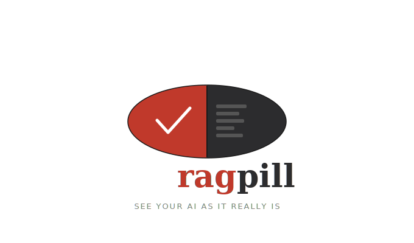

<p align="center">
  
</p>

<p align="center">
  <em>Stop believing your chatbot. Take the ragpill.</em>
</p>

<p align="center">
  <a href="https://github.com/JoelGotsch/ragpill/actions/workflows/ci.yml"></a>
  <a href="https://pypi.org/project/ragpill/"></a>
  <a href="https://pypi.org/project/ragpill/"></a>
  <a href="https://codecov.io/gh/JoelGotsch/ragpill"></a>
  <a href="https://github.com/JoelGotsch/ragpill/blob/main/LICENSE"></a>
  <a href="https://joelgotsch.github.io/ragpill/latest/"></a>
  <a href="https://github.com/astral-sh/ruff"></a>
  
</p>

---

**ragpill** is an evaluation framework for LLM agents and RAG pipelines. Define facts, sources, and tool call expectations — and find out what your AI actually does.

## What is RAGPill?

If you are building an LLM-based application, ragpill's ultimate goal is to help you:

1. **Build a testset** that captures what "good" looks like for your application — facts, sources, tool calls, and domain-specific criteria.
2. **Run it locally** against your app, with first-class integrations for **MLflow** (today) and **Langfuse** (planned), so traces and evaluations live next to your existing observability stack.
3. **Integrate it into your workflow** (CI/CD, pre-deploy checks, local iteration loops) to **prevent regressions** and **objectively measure progress** when you tweak system prompts, swap models, change retrieval parameters, or refactor agent logic.

It specializes in "offline" evaluation of LLM-based systems — meant to be part of your CI/CD pipeline or scheduled tests, not real-time monitoring.

RAGPill helps you:

- **Create test datasets from CSV files** - Easy collaboration with domain experts
- **Define custom evaluators** - Add domain-specific knowledge to evaluations
- **Track results in MLflow** - Full experiment tracking and tracing
- **Follow best practices** - Opinionated design guides you to robust testing

### Where this is heading: agent-assisted evaluation

ragpill is built so that an agent (e.g. Claude Code) can be a first-class participant in the evaluation loop:

- **Testset co-creation**: ragpill will expose a **skill** that your agent can consume to build the testset *together with the developer* — turning vague product expectations into concrete cases, evaluators, tags, and attributes.
- **Investigative harness**: the package will provide the harness an agent needs to **investigate an evaluation run and suggest improvements** — to the testset, the application config, or the overall solution.

  *Example:* a question asks about the **timeline of events** scattered across different chunks. The agent analyzes the failed run, notices the timestamps are already present in chunk metadata but can't be filtered on, which clutters retrieval with irrelevant chunks — and suggests adding a metadata filter on the date field.

<!--
## Demo!

TODO: this should be a video demo
Prerequisites:
- [ragpill installed](docs/getting-started/installation.md)
- MLflow tracking server running (local or remote) with tracing enabled.
Locally: `mlflow server --backend-store-uri sqlite:///mlflow.db` or if remote, then configure the env vars properly.

```python


```
Produces the following mlflow views:

### Metrics View
[](https://www.youtube.com/watch?v=your-video-id)

### Traces Views

### Artifacts View
[](https://www.youtube.com/watch?v=your-video-id)

### Comparing runs

### What's wrong with other frameworks?

- The [pydantic-ai's evaluation framework](https://ai.pydantic.dev/evals/) only integrates with cloud-based logfire and it sucks for mlflow tracing (if you go the hassle and use mlflow opentelemetry endpoint as logfire backend, a lot of mlflow features are lost in translation). However, we like the core concepts and type-safety of pydantic-ai evals a lot, so we build on top of it.
- additionally, it's not straightforward to test for example, if a regex pattern is found in retrieved sources or document metadata. Which is common enough in retrieval-augmented generation (RAG) systems.
- [Langsmith evaluation](https://docs.langchain.com/langsmith/evaluation) doesn't support multiple tests per dataset item, nor custom evaluators easily. Also no mlflow integration.
-->


## Core Philosophy

Here we focus a lot on the [LLM Judge evaluator](docs/api/evaluators.md#llmjudge), although it's the last evaluator you should use - prefer deterministic evaluators (regex, exact match) whenever possible. 
However, for deterministic tests, there's already a lot of tooling available, like pytest for example (yes, we like the 'code-first' approach).

### Expert-Defined Attributes

LLM judges usually lack context awareness to judge which discrepancies between chatbot answers and expected answers are relevant - especially in specialized fields like law, engineering, and science where words have precise definitions.

**Domain experts should define specific attributes and criteria for evaluation.**

### Binary Evaluations

We use **boolean pass/fail values only**, not scoring scales (1-10), because:

- Scales are arbitrary and often decided by LLMs
- Binary decisions are more stable and reproducible (although LLMs of course remain probabilistic)
- Easier to track and reason about over time

### Tags and Attributes for Organization

Evaluators can have:

- **Tags**: Categorical labels for filtering (e.g., `retrieval`, `time-aware-rag`, `basic_logic`)
- **Attributes**: Key-value metadata for categorization (e.g., `importance: high`, `scope: Phase1`)

Metrics are automatically calculated per tag and attribute.


## Quick Navigation

### Getting Started:

- [Installation](docs/getting-started/installation.md)
- [Quick Start](docs/getting-started/quickstart.md)

### Evaluators:

## Key Concepts

ragpill is built around three independent layers — execute, evaluate, upload — so you can mix and match them to fit your workflow. See the [Layered Architecture Guide](docs/guide/layered-architecture.md) for details.


### Key Components

- **Dataset / Case**: Plain dataclasses from `ragpill.eval_types` that hold test cases with inputs, evaluators, and metadata
- **Evaluators**: Check if outputs meet criteria (LLMJudge, regex matchers, custom evaluators)
- **Three-Layer Pipeline**: `execute_dataset` (run tasks + capture traces) → `evaluate_results` (apply evaluators) → `upload_to_mlflow` (persist). Use the layers independently or together via `evaluate_testset_with_mlflow`. See the [Layered Architecture Guide](docs/guide/layered-architecture.md).

## Features

- **Async-only API**: Integrates naturally with modern async frameworks. Wrap in `asyncio.run()` if you need sync.
- **Dual-backend tracing**: Capture traces to a local temp SQLite DB (no server needed) or directly to an MLflow server.
- **Run once, evaluate many**: The captured `DatasetRunOutput` is JSON-serializable, so you can re-evaluate historical outputs against new evaluator sets without re-running the task.
- **Great MLflow Integration**: Traces your agent/function execution to MLflow with evaluations in the native format
- **CSV/Excel Adapter**: Load test cases from CSV files with evaluator configurations
- **Flexible Evaluators**: Built-in LLM judges, regex matchers, and easy custom evaluator creation
- **Metrics per Tags/Attributes**: Automatic metric calculation for each tag and attribute combination
- **Type Safety**: Built on plain dataclasses with full type safety throughout

## [Built-in Evaluators](docs/api/evaluators.md)

- [**LLMJudge**](docs/api/evaluators.md#llmjudge): Uses an LLM to judge correctness based on a rubric
- [**RegexInSourcesEvaluator**](docs/api/evaluators.md#regexinsourcesevaluator): Checks if regex patterns appear in retrieved sources
- [**RegexInDocumentMetadataEvaluator**](docs/api/evaluators.md#regexindocumentmetadataevaluator): Checks regex in document metadata
- [**Custom Evaluators**](docs/guide/evaluators.md#creating-custom-evaluators): Inherit from `BaseEvaluator` and implement your logic

## Best Practices

> [!TIP]
> **TDD Mindset** — Begin with defining a Test-Set with potential users before even starting to develop the solution. This enables clear expectation management and progress tracking.

> [!TIP]
> **Create Multiple Testsets** — It might make sense for you to have some core tests that run relatively quickly and inexpensive - use these for development. Before deploying to prod, you can run an exhaustive dataset that is integrated in your CI/CD.

> [!TIP]
> **Separate Evaluation Experiments** — Create dedicated MLflow experiments for evaluations. Don't mix evaluation traces with production traces.

> [!TIP]
> **Use Domain Experts** — Have domain experts define evaluation criteria rather than relying solely on generic LLM judges.

> [!TIP]
> **Version Your Tests** — Keep test datasets in version control alongside your code.

## Documentation

Full documentation is available at [joelgotsch.github.io/ragpill/latest](https://joelgotsch.github.io/ragpill/latest/) including:

- **Installation Guide**: Setup instructions
- **Quickstart Tutorial**: Run your first evaluation
- **CSV Adapter Guide**: Learn the CSV format and column meanings
- **Evaluators Guide**: Create custom evaluators
- **MLflow Integration**: Advanced MLflow usage
- **API Reference**: Complete API documentation

## Roadmap

- [x] Adapter for testset from CSV
- [x] Documentation via mkdocs
- [x] Evaluators for sources and regex
- [ ] Repeat Task Evaluations (run task multiple times and evaluate with threshold)
- [ ] Adapter for task from CSV (upload to mlflow)
- [ ] Create demo video
- [ ] CI/CD (tests, build package, publish docs)
- [x] Global evaluators from CSV (empty input)
- [ ] Track git-commit hash in experiment
- [x] Tests with mlflow server
- [ ] Dependency injection for llm, input_to_key functions
- [ ] pytest integration


## Contributing

Contributions are welcome! Please see [CONTRIBUTING.md](docs/development/contributing.md) for guidelines.
